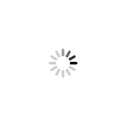

# F E E E E L S

feeeels is a publication that explores art, culture, politics, history, and emotions through the lens of one tactile adjective per issue. Visual and written works from over 25 contributors investigate the role of tactility in an increasingly flat and digital age.

# [projectname](https://projectname.net) statement of intent: 

The feeeels website is a result of 3 in-person 48 hour sprints and an amalgam of digital communications over the past 6 months (June - Dec 2019). Our initial ambition was to create a social media application of sorts to extract labor from it’s users (both the publishers and readers). We think the idea here probably had something to do with the materiality of labor, especially when it is forced. We chose not to pursue this after discussion began to be focus more on a way to aesthetically capture the publications content. It was the content that should capture the idea of materiality and the design was meant to endorse this effort. From there we think what became most important was how the website *felt*, both as a screen and as a part of our physical environment. 

Interfaces, especially websites, are the flattening of data. In many ways, feeeels.com mimics a contemporary web app. However, instead of disguising the loading of new data to repopulate the *existing* HTML document through deceptive animations , the feeeels user interface utilizes long-standing CSS pseudo-classes representing `hover`, `focus`, and `active` [states](https://developer.mozilla.org/en-US/docs/Web/CSS/:active) and pulls *different* HTML documents from the server.

This method was chosen for its physical implications: by letting the browser reload we draw attention to the negative space between our actions and the server's response. 